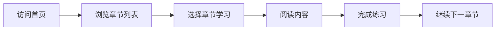

# AI零基础教程网站规划方案

## 1. 项目概述
- 本项目旨在创建一个美观、易用的AI零基础教程网站，覆盖从入门到精通的完整学习路径，最终部署到GitHub Pages上。
- 目标用户为对AI感兴趣但缺乏基础知识的普通用户、职场人士和学生，帮助他们快速上手各种AI工具。

## 2. 核心功能

### 2.1 用户角色
| 角色 | 注册方法 | 核心权限 |
|------|----------|----------|
| 普通访客 | 无需注册 | 浏览所有教程内容，查看示例 |

### 2.2 功能模块
1. **首页**：英雄区、导航、章节列表、快速入门指南
2. **章节页面**：教程内容、示例代码、互动练习
3. **关于页面**：项目介绍、贡献指南

### 2.3 页面详情
| 页面名称 | 模块名称 | 功能描述 |
|---------|---------|---------|
| 首页 | 英雄区 | 欢迎横幅、项目简介、开始学习按钮 |
| 首页 | 章节导航 | 教程章节列表，包含进度指示器 |
| 首页 | 快速指南 | AI入门3步曲，帮助用户快速上手 |
| 章节详情页 | 内容区 | 详细教程内容、图片、代码示例 |
| 章节详情页 | 学习进度 | 章节完成状态标记 |
| 章节详情页 | 导航栏 | 上一章/下一章快速跳转 |

## 3. 核心流程
- 用户访问首页 → 浏览章节列表 → 选择感兴趣的章节开始学习 → 完成章节内容 → 继续下一章节



## 4. 用户界面设计

### 4.1 设计风格
- **主色调**：蓝色系（代表科技感）+ 绿色系（代表学习和成长）
- **辅助色**：柔和的紫色和橙色
- **按钮风格**：圆角矩形，有悬停效果
- **字体**：系统默认无衬线字体，标题使用较大字号
- **布局风格**：卡片式布局，内容分区清晰
- **图标风格**：现代化扁平化图标，适当使用emoji增加亲和力

### 4.2 页面设计概述
| 页面名称 | 模块名称 | UI元素 |
|---------|---------|-------|
| 首页 | 英雄区 | 渐变背景，大标题，副标题，行动按钮，居中布局 |
| 首页 | 章节导航 | 卡片网格布局，每个卡片有图标、标题、简介，悬停效果 |
| 章节详情页 | 内容区 | 侧边栏导航 + 主内容区，标题层级清晰，代码块高亮，图片支持 |

### 4.3 响应式设计
- 采用桌面优先，移动端自适应的策略
- 平板和手机设备优化布局和字体大小
- 触摸区域优化，适合移动设备使用

## 5. 章节规划（分步制作）

### 教程编写标准
根据第一节的实现标准，后续章节应遵循以下要求：

1. **内容详实**：
   - 每个主题应有详细的解释和说明
   - 包含核心概念的定义和解释
   - 提供具体的例子和应用场景

2. **图文并茂**：
   - 每节内容至少包含3-4张相关图片
   - 图片应使用教育风格的插图
   - 图片下方应有简短的说明文字

3. **结构清晰**：
   - 采用层次分明的标题结构
   - 每个章节包含多个小节
   - 小节之间逻辑连贯

4. **互动元素**：
   - 每节末尾包含思考与讨论环节
   - 提供具体的示例和想法，而非生硬的问答
   - 鼓励用户思考和参与

5. **技术原理**：
   - 适当介绍相关技术原理
   - 解释AI工具的工作原理
   - 帮助用户理解背后的技术逻辑

6. **实用性**：
   - 内容应贴近实际应用
   - 提供实用的技巧和建议
   - 帮助用户真正掌握AI工具的使用

### 第一章：AI入门 - 了解AI是什么
- 1.1 AI简介与发展历史（基础概念和发展历程）
- 1.2 AI是什么？不是什么？（本质和能力边界）
- 1.3 AI能为你做什么？（应用领域概览）
- 1.4 AI的基本类型（工具分类和特点）
- 1.5 安全使用AI的原则（安全和伦理）

### 第二章：大语言模型入门
- 2.1 什么是大语言模型？（概念和基本原理）
- 2.2 主流大语言模型介绍（ChatGPT、Claude、Gemini等）
- 2.3 注册与首次使用（账号注册和界面介绍）
- 2.4 基础功能演示（核心功能和使用方法）
- 2.5 实践：写第一篇文章（完整写作流程）

### 第三章：AI写作与内容创作
- 3.1 写作原理与技巧（LLM写作原理）
- 3.2 写邮件（邮件写作技巧）
- 3.3 写报告与总结（正式文档写作）
- 3.4 创意写作（故事、诗歌等创作）
- 3.5 内容改写与润色（内容优化技巧）
- 3.6 实践：完成一份完整的内容创作任务

### 第四章：图像生成工具
- 4.1 图像生成原理（扩散模型等原理）
- 4.2 主流图像生成工具（MidJourney、DALL·E等）
- 4.3 提示词技巧（如何写出好的提示词）
- 4.4 图像编辑与优化（修改和增强图像）
- 4.5 实践：创建创意图像

### 第五章：AI辅助办公
- 5.1 办公自动化原理（RPA和AI结合）
- 5.2 文档处理（智能文档管理）
- 5.3 会议助手（会议记录和总结）
- 5.4 数据分析（AI辅助数据分析）
- 5.5 实践：优化工作流程

### 第六章：AI学习与研究
- 6.1 学习原理（个性化学习算法）
- 6.2 知识获取（信息检索和整合）
- 6.3 概念理解（复杂概念解释）
- 6.4 研究辅助（文献综述和分析）
- 6.5 实践：设计个性化学习计划

### 第七章：进阶提示词技巧
- 7.1 提示词工程原理（如何设计有效提示）
- 7.2 基础提示词结构（标准提示格式）
- 7.3 高级提示技巧（上下文管理和引导）
- 7.4 领域特定提示（专业领域提示词）
- 7.5 实践：创建高效提示词模板

### 第八章：AI工具综合应用
- 8.1 多工具协同原理（工具链和工作流）
- 8.2 跨领域应用（不同工具的组合使用）
- 8.3 案例分析（真实应用案例）
- 8.4 未来趋势（AI发展方向）
- 8.5 实践：构建完整AI工作流

## 6. 技术实现规划

### 技术栈
- **框架**：Vite + React + TypeScript（现代开发体验）
- **样式**：Tailwind CSS（快速构建美观界面）
- **部署**：GitHub Pages（简单免费）
- **内容管理**：Markdown文件（便于维护）
- **图标**：Lucide React（现代化图标库）

### 项目结构
```
/workspace/
├── src/
│   ├── components/        # 组件目录
│   │   ├── Header.tsx
│   │   ├── Footer.tsx
│   │   ├── ChapterCard.tsx
│   │   └── ...
│   ├── pages/            # 页面目录
│   │   ├── Home.tsx
│   │   ├── Chapter.tsx
│   │   └── About.tsx
│   ├── data/             # 数据目录
│   │   └── chapters.ts   # 章节数据
│   ├── App.tsx
│   └── main.tsx
├── public/
├── index.html
├── package.json
├── vite.config.ts
└── tailwind.config.js
```

### 路由定义
| 路由 | 用途 |
|------|------|
| / | 首页 |
| /chapter/:id | 章节详情页 |
| /about | 关于页面 |

## 7. 实施计划

### 第一阶段：项目初始化与基础框架（已准备）
1. 创建项目结构
2. 配置Vite + React + TypeScript
3. 配置Tailwind CSS
4. 设置基础组件（Header、Footer等）

### 第二阶段：首页与第一章内容
1. 实现首页设计
2. 创建章节数据结构
3. 编写第一章完整内容
4. 实现章节导航功能

### 第三阶段：后续章节制作
1. 与用户审核后，逐步制作剩余章节
2. 实现章节间导航
3. 添加进度标记功能

### 第四阶段：优化与部署
1. 响应式优化
2. 性能优化
3. 配置GitHub Pages部署
4. 最终测试

## 8. 风险处理
- **内容审核**：采用章节分步审核机制，确保每一章质量
- **技术选型**：使用成熟的技术栈，避免复杂依赖
- **部署简单**：GitHub Pages易于配置和维护
